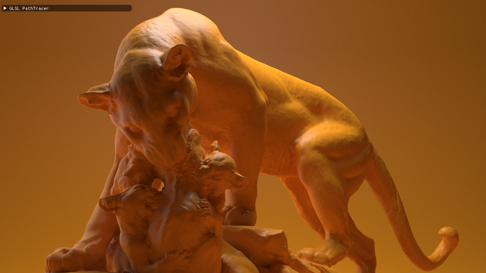
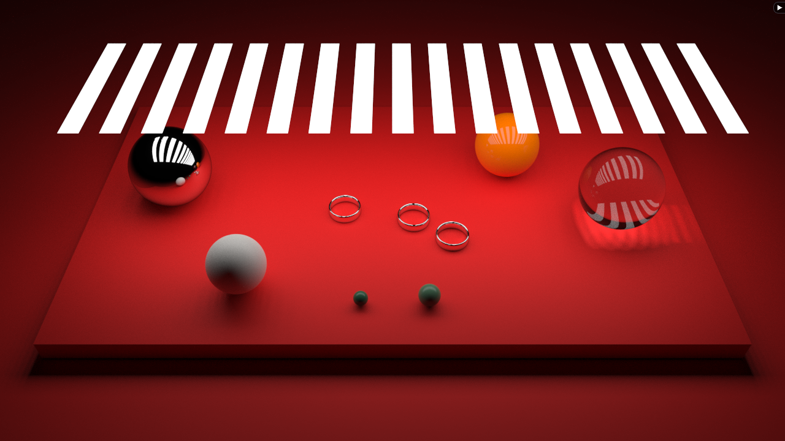
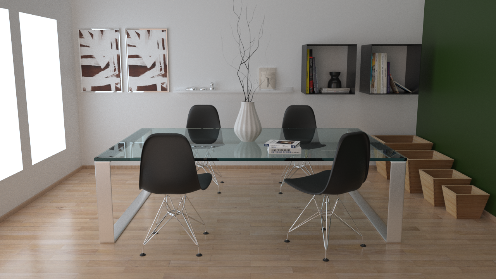
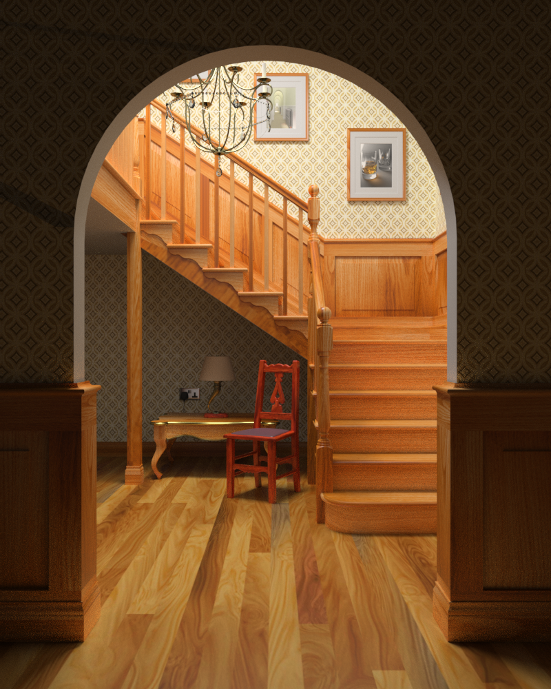
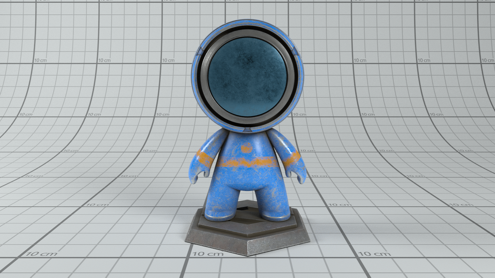
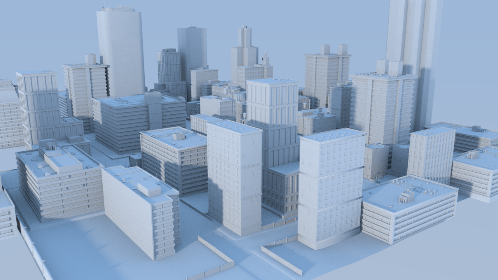
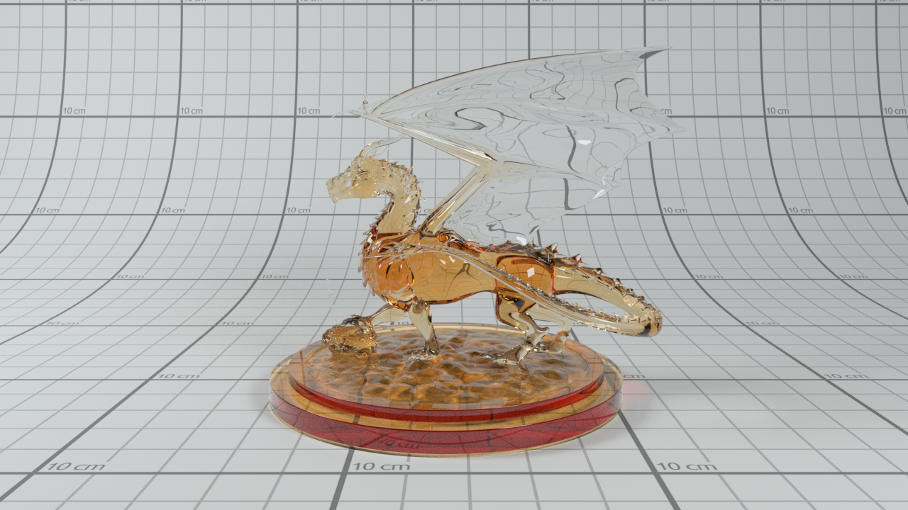

GLSL-PathTracer
==========
A physically based path tracer that runs in a GLSL fragment shader.

Features
--------
- Unidirectional path tracer
- RadeonRays for building BVHs (Traversal is performed in a shader)
- Disney BSDF
- Texture Mapping (Albedo, Metallic-Roughness, Normal)
- Spherical and Rectangular Area Lights
- IBL with importance sampling
- Progressive + Tiled Rendering (Reduces GPU usage and timeout when depth/scene complexity is high)

Build Instructions
--------
Please see INSTALL-WIN.txt for the build instructions for Windows and INSTALL-LINUX.txt for Linux

Sample Scenes
--------
A couple of sample scenes are provided in the repository. Additional scenes can be downloaded from here:
https://drive.google.com/file/d/1UFMMoVb5uB7WIvCeHOfQ2dCQSxNMXluB/view

Gallery
--------

--------

--------

--------

--------

--------

--------

--------

References/Credits
--------
- A huge shout-out to Cedric Guillemet (https://github.com/CedricGuillemet) for cleaning up the code, adding the UI, integrating ImGuizmo, cmake and quite a lot of fixes.
- Tinsel Renderer (https://github.com/mmacklin/tinsel) A really amazing renderer which has several features. A modified version of the scene description & loader are taken from here. Reference for MIS, light sampling
- Ray Tracing in One Weekend (https://github.com/petershirley/raytracinginoneweekend) Peter Shirley's excellent book introductory book on raytracing which helped me get started on this project
- Mitsuba Renderer (https://github.com/mitsuba-renderer/mitsuba) Reference for validation of the code.
- Erich Loftis's THREE.js PathTracer (https://github.com/erichlof/THREE.js-PathTracing-Renderer) Several amazing webgl examples including bidirectional path tracing; all running in a web browser.
- OptiX Introduction Samples (https://github.com/nvpro-samples/optix_advanced_samples/tree/master/src/optixIntroduction)
