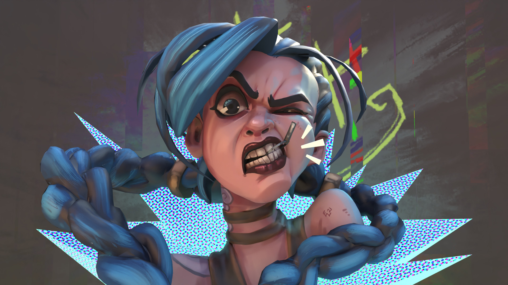
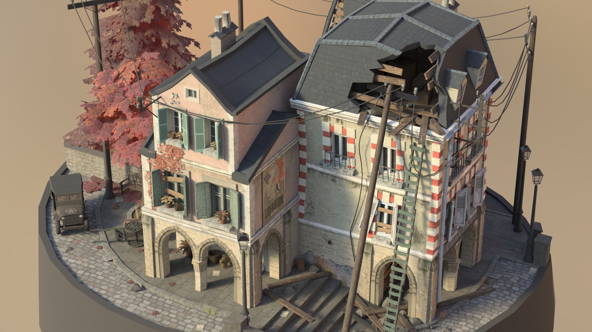
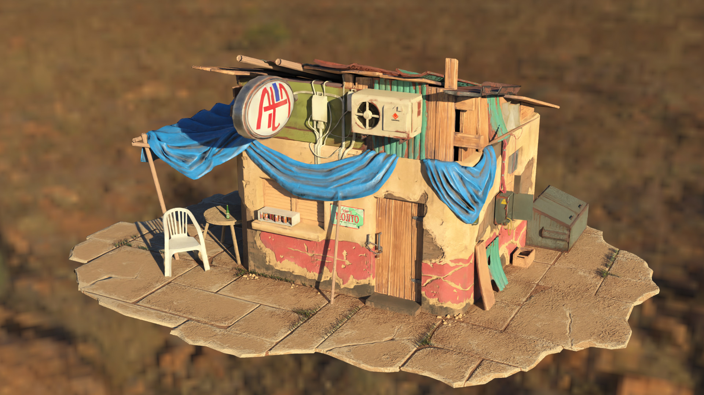
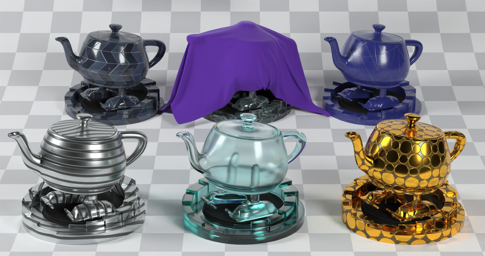
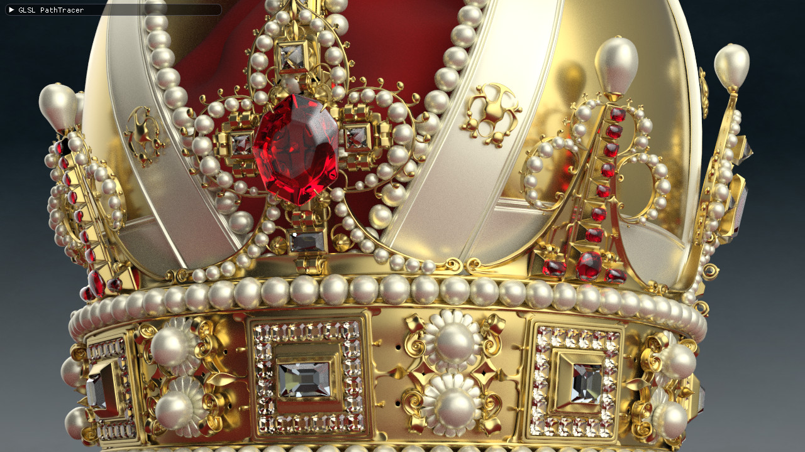
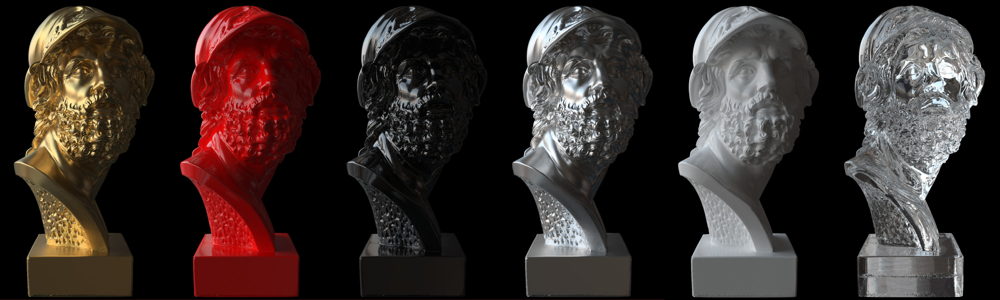
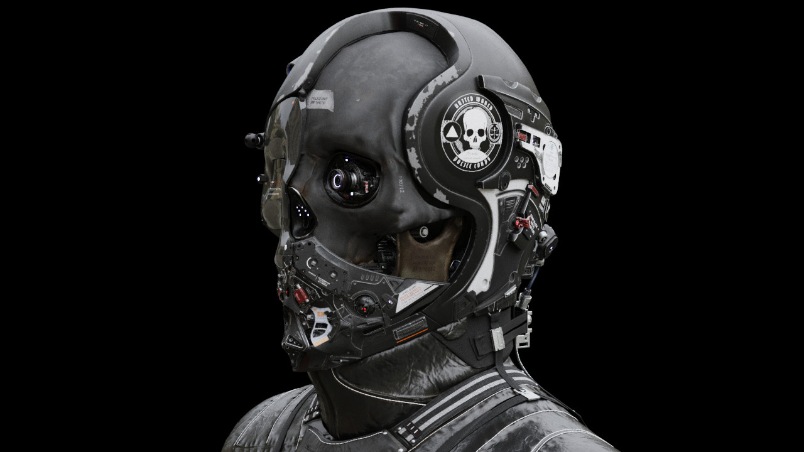
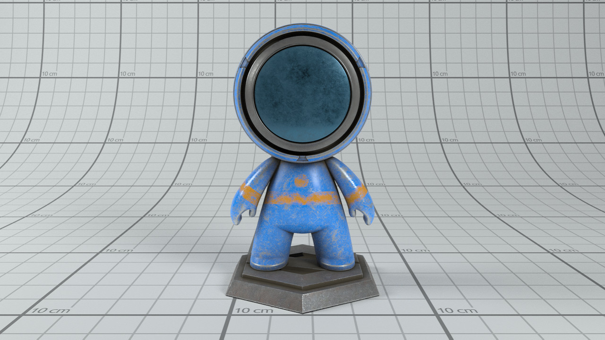

GLSL-PathTracer
==========
A physically based path tracer that runs in a GLSL fragment shader.

Features
--------
- Unidirectional path tracer
- BVH builder from RadeonRays 2.0
- Disney BSDF
- Texture mapping (Albedo, Metallic-Roughness, Normal, Emission)
- Analytic lights (Sphere, Rectangular, Directional)
- Image based lighting
- Multiple importance sampling (between BSDF and lights)
- Tile rendering
- OpenImageDenoise
- GLTF/GLB support (In progress)
- Homogeneous volumes (In progress)

Build Instructions
--------
Please see INSTALL-WIN.txt for the build instructions for Windows and INSTALL-LINUX.txt for Linux

Sample Scenes
--------
A couple of sample scenes are provided in the repository. Additional scenes can be downloaded from here:
https://drive.google.com/file/d/1UFMMoVb5uB7WIvCeHOfQ2dCQSxNMXluB/view

Gallery
--------

--------

--------

--------

--------

--------

--------

--------

--------

--------

--------

--------

--------

--------

References/Credits
--------
- A huge shout-out to Cedric Guillemet (https://github.com/CedricGuillemet) for cleaning up the code, adding the UI, integrating ImGuizmo, cmake and quite a lot of fixes.
- Tinsel Renderer (https://github.com/mmacklin/tinsel) A modified version of the scene description & loader from that project is used here.
- Ray Tracing in One Weekend (https://github.com/petershirley/raytracinginoneweekend) Peter Shirley's excellent book introductory book on raytracing which helped me get started on this project.
- Erich Loftis's THREE.js PathTracer (https://github.com/erichlof/THREE.js-PathTracing-Renderer).
- OptiX Introduction Samples (https://github.com/nvpro-samples/optix_advanced_samples/tree/master/src/optixIntroduction)
- Mitsuba Renderer (https://github.com/mitsuba-renderer/mitsuba) Reference for validation.
- PBRT-v3 (https://github.com/mmp/pbrt-v3) which provides an endless source of knowledge. The online book is a gift that keeps giving.
- Model links/credits are in the assets folder (See: Model Credits.txt)
